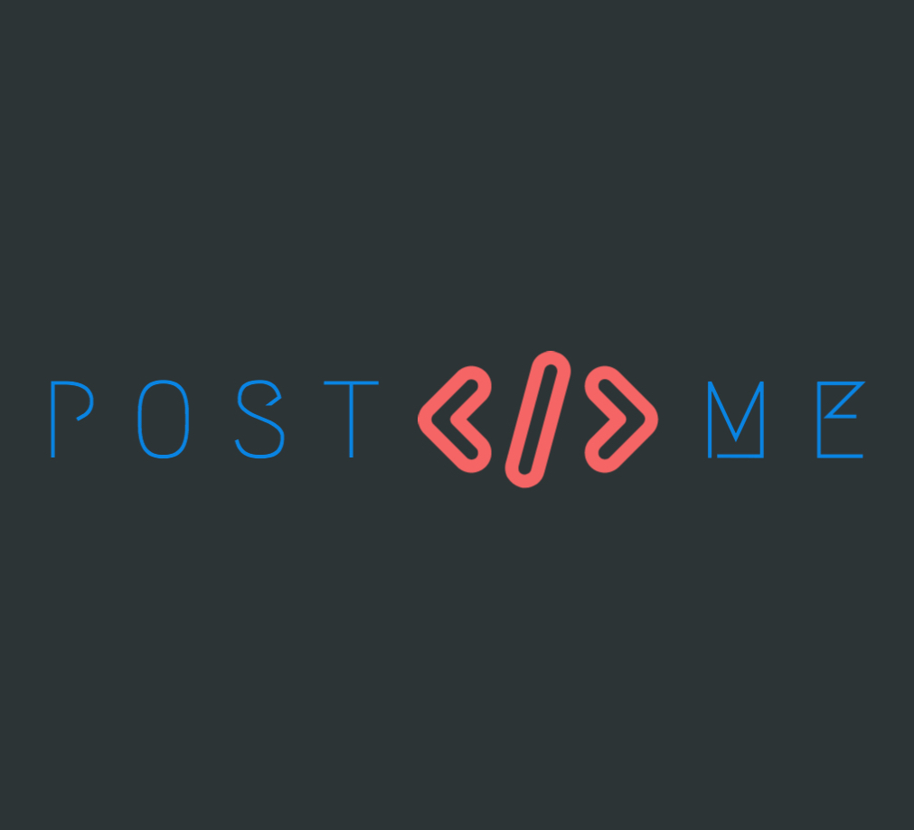

# 🏴 PostMe

## Lcoal Development

* Clone this project

### ENV Variables
* Create a ``.env`` file in the root directory and add these variables (don't include the comments xD)
```
PORT=                            //make this whatever you want
GITHUB_SECRET=                   //make this whatever you want
TWITTER_CONSUMER_KEY=            //from twitter developer portal
TWITTER_CONSUMER_SECRET=         //from twitter developer portal
TWITTER_ACCESS_TOKEN_KEY=        //from twitter developer portal
TWITTER_ACCESS_TOKEN_SECRET=     //from twitter developer portal
```


### Start Server
* Run `yarn install` to install packages
* Run `yarn watch` to start the typescript compiler
* (In a new terminal tab) `yarn dev` to start the server
* Run [`ngrok`](https://ngrok.com/) | `ngrok http 5000`

### Github Setup
* Add ngrok url to github repository webhook
* Change content type to `application/json`
* Add webhook

You're all done!
